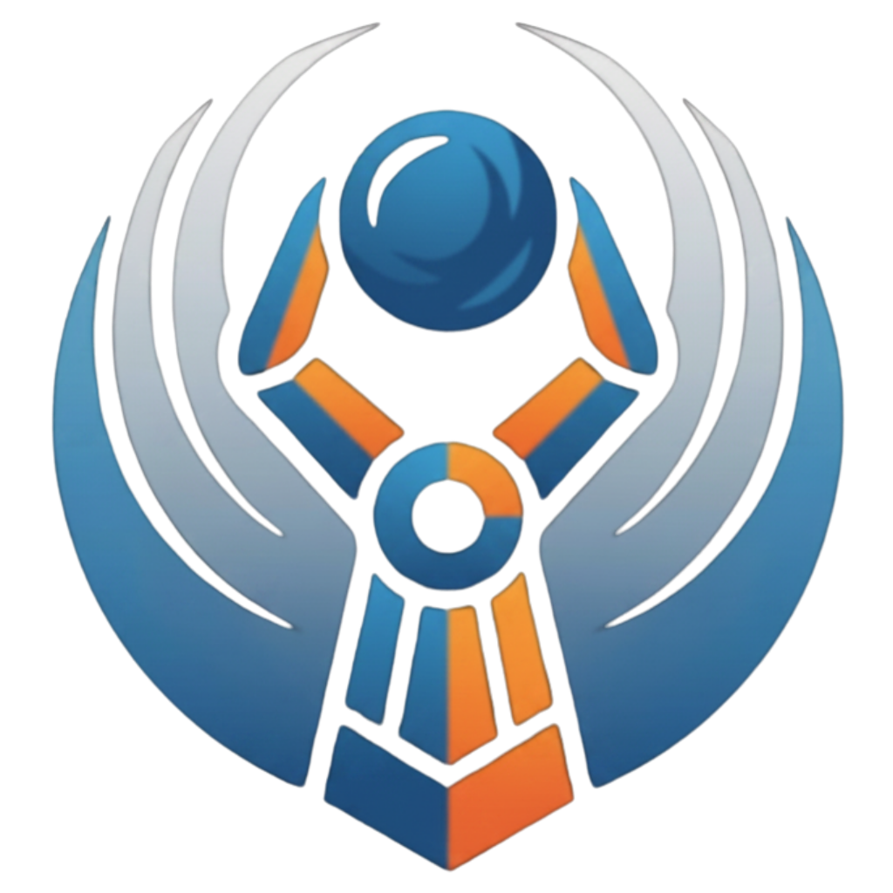

# 🌌 GravityClaw Command Center V2

GravityClaw is a premium, containerized **AI Agent Control UI** and companion **Cognitive Architecture** designed for local, privacy-first, and highly configurable automation. It wraps advanced planning capabilities, voice transcribing, dynamic episodic memory, and Model Context Protocol (MCP) integrations in a stunning, translucent dark glassmorphism dashboard.



---

## 🎨 System Architecture (C.A.W. Framework)

GravityClaw runs on the advanced **C.A.W.** (Connect, Listen, Memory, Wire) cognitive framework, keeping the agent responsive, aware, and highly integrated:

### 1. **C — Connect (Agent Loop)**
- Runs a robust main cognitive loop (`src/agent/loop.py`) that reads system settings, parses memories, feeds the context to the Google `gemini` CLI interface, and processes inputs asynchronously.
- Connects simultaneously to a unified **FastAPI server** on port `8080` for web chat and an asynchronous background task for polling Telegram messages.

### 2. **L — Listen (Voice & Whisper Transcription)**
- Processes audio voice notes from Telegram using **Groq's Whisper API** (`src/interface/voice.py`).
- Instantly transcribes voice messages in milliseconds and routes them into the main AI agent loop, returning vocal response transcripts.

### 3. **M — Memory (Dynamic & Semantic)**
- **Core Memory (`MEMORY.md`)**: A transparent, human-editable long-term registry of durable facts, standing directives, and system prompts.
- **Daily Episodic Notes (`memory/YYYY-MM-DD.md`)**: Chronological buffers capturing all observations, tool calls, and inputs throughout the day.
- **Semantic Vector Storage**: Leverages **ChromaDB** to index and retrieve past interactions based on semantic relevance.

### 4. **W — Wire (MCP Tools Registry)**
- Implements a fully dynamic **Model Context Protocol (MCP)** server manager.
- Integrates pre-built quick templates and dynamic forms to manage, add, edit, or delete tool integrations (GitHub, Brave Search, Notion, Google Drive, Gmail, Activepieces, etc.) persisting configuration directly in the host workspace.

### 5. **P — Playbooks (Skills Manager)**
- Lists, edits, installs, and uninstalls modular skills.
- Offers a search-and-filter discovery panel syncing directly with the global awesome-skills repository, allowing one-click background installs and real-time logs streamed to a stylized terminal console.

---

## ⚙️ Requirements

Before installing and running GravityClaw, ensure you have the following prerequisites configured on your system:

### Standard Requirements
- **Docker & Docker Compose** (highly recommended for absolute portability and isolation).
- **Python 3.10+** (if running locally/manually).
- **Git** (for version control and repository management).

### Keys & Environment Variables (Optional but recommended)
- **Gemini API Key**: For core inference via the Antigravity agent or Gemini services.
- **Groq API Key**: Needed for rapid voice transcription (Whisper) and fallback model inference.
- **Telegram Bot Token**: Needed if you wish to talk to your bot directly via Telegram (obtained via `@BotFather`).

---

## 🚀 Quick Start with Docker (Recommended)

Docker Compose maps local configurations dynamically and mounts source files so edits are active instantly.

### 1. Clone & Prepare Project
Clone your files into a local folder:
```bash
git clone https://github.com/yourusername/GravityClaw.git
cd GravityClaw
```

### 2. Configure Environment Variables
Copy the example environment file and adjust your keys:
```bash
cp .env.example .env
```
Open the `.env` file and set your primary API keys:
```env
TELEGRAM_BOT_TOKEN=your_telegram_bot_token
GROQ_API_KEY=your_groq_api_key
GEMINI_API_KEY=your_gemini_api_key
```

### 3. Build and Run
Fire up the Docker container:
```bash
docker-compose up --build
```

The unified control panel will boot up immediately.
- **Control UI**: Open your web browser and navigate to **`http://localhost:8080`**.
- **Web Chat**: Start talking to the agent immediately in the **Chat** tab!
- **Telegram Bot**: If a valid token is set, toggle the **Telegram Bot Integration** switch to **ON** in the **Integrations** tab.

---

## 🐍 Manual Installation (Local Python Run)

If you prefer to execute the application directly on your host machine without Docker:

### 1. Create a Virtual Environment
```bash
python -m venv .venv
source .venv/bin/activate  # On Windows: .venv\Scripts\activate
```

### 2. Install Dependencies
```bash
pip install -r requirements.txt
```

### 3. Setup Configuration
Initialize your `.env` file just like in the Docker instructions:
```bash
cp .env.example .env
```

Ensure the `.gemini` folder structures are initialized in your user profile:
- Windows: `C:\Users\<YourUser>\.gemini`
- Linux/macOS: `~/.gemini`

### 4. Run the API Server
```bash
python -m src.api.server
```

---

## 📂 Project Directory Structure

```filepath
GravityClaw/
├── src/
│   ├── agent/
│   │   └── loop.py             # Core agent cognitive thread
│   ├── api/
│   │   ├── static/             # Premium Glassmorphism UI files
│   │   │   ├── index.html      # Main markup
│   │   │   ├── style.css       # Translucent styling system
│   │   │   ├── app.js          # Tab routing, form CRUD, integrations handlers
│   │   │   └── logo.png        # Transparent brand logo
│   │   └── server.py           # FastAPI server & async background Telegram task
│   ├── interface/
│   │   ├── telegram_bridge.py  # Telegram bot interface (polling)
│   │   └── voice.py            # Audio transcription processor (Whisper API)
│   ├── memory/
│   │   ├── core.py             # Durable facts processor (MEMORY.md)
│   │   ├── buffer.py           # Daily notes episodic buffer (memory/YYYY-MM-DD.md)
│   │   └── semantic.py         # Vector memory storage (ChromaDB)
│   └── tools/
│       ├── mcp_client.py       # MCP client protocol runner
│       └── registry.py         # MCP tool discovery system
├── tests/                      # Integration and unit tests
├── .env                        # Local API Keys (never commit!)
├── config.yaml                 # Core cognitive settings & models
├── Dockerfile                  # Container definition
├── docker-compose.yml          # Port mappings and dynamic volumes
└── README.md                   # Project documentation
```

---

## 🛠️ Dynamic Configurations in the UI

Once logged in at `http://localhost:8080`, check out the dynamic panels in the **Integrations** tab:

### ⚡ Telegram Bot Control Card
- Click **⚙ Configure** to paste a token and hit **Save & Apply**.
- Flip the toggle switch to start or stop the background Telegram message polling seamlessly.

### 🔌 MCP Server Registry
- Build and add any number of Model Context Protocol (MCP) servers (command, arguments, and environment variables).
- Pre-filled template blocks for Brave Search, GitHub, Notion, Google Drive, and DuckDuckGo search are available for one-click setup.

### 🔑 Environment Keys
- Click **+ Add Key** to dynamically append new configuration keys (API credentials) directly to the host `.env` file from the UI.
- Click **Edit** to update an existing key's value, or **Delete** to remove it safely.

---

## 📝 License
This project is licensed under the MIT License. See the LICENSE file for details.
